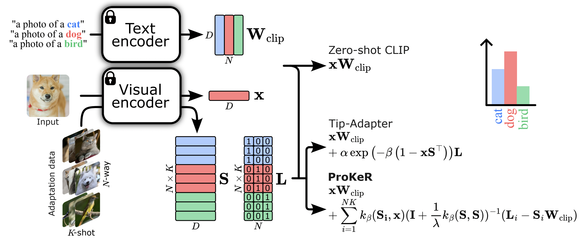

<h1 align='center' style="text-align:center; font-weight:bold; font-size:2.0em;letter-spacing:2.0px;"> ProKeR: A Kernel Perspective on Few-Shot Adaptation of Large Vision-Language Models </h1>
<p align="center" style="margin: 0;">🎉 Paper accepted at <strong>CVPR 2025</strong>! 🎉</p>
<div style="text-align: center">
<a href="https://ybendou.github.io/ProKeR/" style="font-size:1.25em;">Project Page</a>
</div>
<p align='center' style="text-align:center;font-size:1.25em;">
    <a href="https://scholar.google.fr/citations?user=Hfzg6rcAAAAJ&hl=fr&oi=ao" target="_blank" style="text-decoration: none;">Yassir Bendou<sup>1</sup></a>&nbsp;,&nbsp;
    <a href="https://scholar.google.fr/citations?user=IdcK7TcAAAAJ&hl=fr&oi=ao" target="_blank" style="text-decoration: none;">Amine Ouasfi<sup>2</sup></a>&nbsp;,&nbsp;
    <a href="https://scholar.google.fr/citations?user=n3IKEqgAAAAJ&hl=fr&oi=ao" target="_blank" style="text-decoration: none;">Vincent Gripon<sup>1</sup></a>&nbsp;,&nbsp;
    <a href="https://scholar.google.fr/citations?user=ayfaw7AAAAAJ&hl=fr&oi=ao" target="_blank" style="text-decoration: none;">Adnane Boukhayma<sup>2</sup></a>&nbsp;,&nbsp;
	<br>
<sup>1</sup>IMT Atlantique&nbsp;&nbsp;&nbsp;
<sup>2</sup>INRIA&nbsp;&nbsp;&nbsp;
</p>



## Requirements
### Installation
#### Using conda
Create a conda environment and install dependencies:
```
conda create -n h2b python=3.9
conda activate h2b

pip install -r requirements.txt
```
#### Using uv
If you prefer to use uv:
```
uv venv --python 3.9
source .venv/bin/activate
uv pip install -r requirements.txt
```
### Dataset
Follow [DATASET.md](DATASET.md) to install ImageNet and other datasets referring to [CoOp](https://github.com/KaiyangZhou/CoOp).

## Get Started
### Configs
The running configurations can be modified in `configs`. 

### Running
For few-shot classification:
```bash
   python main.py --method ProKeR --shots 1 2 4 8 16 --dataset caltech101 --augment-epoch 10
```

If GPU memory is saturated, consider using fewer data augmentations --augment-epoch

## Running Options
Multiple methods are implemented:
| Name                  | Details                        |
|-----------------------|------------------------------------|
| ZeroShot             | [CLIP](https://arxiv.org/pdf/2103.00020)               |
| TIP                  | [Tip-Adapter: Training-free CLIP-Adapter for Better Vision-Language Modeling](https://arxiv.org/pdf/2111.03930)                       |
| GDA                  | [A Hard-to-Beat Baseline for Training-free CLIP-based Adaptation](https://arxiv.org/pdf/2402.04087)                             |
| CLAP                 | [A Closer Look at the Few-Shot Adaptation of Large Vision-Language Models](https://arxiv.org/pdf/2312.12730)                               |
| ProKeR               | ProKeR (ours)                      |
| ProKeR_CLAP_joint    | ProKeR (ours) + [CLAP](https://arxiv.org/pdf/2312.12730) |


## Acknowledgement

This repo benefits from [Tip-Adapter](https://github.com/gaopengcuhk/Tip-Adapter), [CoOp,](https://github.com/KaiyangZhou/Dassl.pytorch) and [GDA](https://github.com/mrflogs/ICLR24). 

## Citation
```latex
@article{ProKeR,
  title={A Kernel Perspective on Training-Free Few-Shot Adaptation of Large Vision-Language Models},
  author={Bendou, Yassir and Ouasfi, Amine and Gripon, Vincent and Boukhayma, Adnane}
  journal   = {arXiv preprint},
  url       = {https://arxiv.org/abs/2501.11175}
}
```

## Contact

If you have any question, feel free to contact yassir.bendou@gmail.com.
